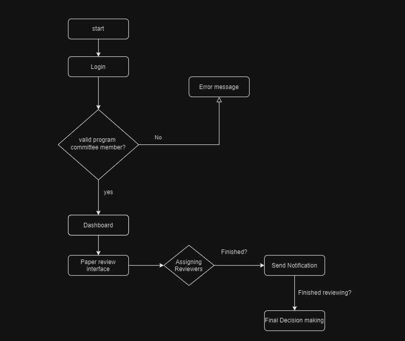

# Program Committee: NITCCONF

## 1. Introduction

### 1.1 Purpose

The purpose of this document is to outline the functional and non-functional requirements for the development of a paper conferencing website. The system is designed to facilitate the submission, review, and decision-making process for academic papers.

### 1.2 Scope

This system will provide a secure and user-friendly platform for program committee members to manage the paper submission and review process. Key features include user authentication, a dashboard for committee members, paper review interface, reviewer assignment, notification system, and decision-making capabilities.

## 2. System Overview

### 2.1 System Description

The paper conferencing website is designed to streamline the conference paper submission and review process. It includes modules for user authentication, dashboard creation, paper review, reviewer assignment, notification system, and decision-making.

### 2.2 Key Features

#### 1.Landing page:

- Keynote speakers:
Create a dedicated section on the landing page to showcase information about keynote speakers.
Include a visually appealing layout with images, brief bios, and affiliations of each keynote speaker.

#### 2. User Authentication and Authorization

- Secure username/password or OAuth authentication for program committee members.
- Role-based access control to restrict unauthorized access to the review interface.
- Display "invalid" error message on failed login attempts.

#### 3. Dashboard

- Upon login, program committee members will have access to a dashboard.
- Sidebar with:
  - Home page which displays the count of papers that are:
       - submitted but not assigned reviewers
       - assigned reviewers but not reviewed
       - reviewed but not decided
       - accepted and rejected papers
  - Paper info:
     - displays titles of the papers that have been submitted by the author.
     - Option to filter based on review status(Submitted,Assigned,Reviewed,Accepted,Rejected).

#### 4. Paper Review Interface

- An interface displaying reviews of each paper.
- Show paper title, paper number, authors and paper tag.

#### 5. Assigning Reviewers

- Ability to assign at least 3 reviewers to a paper.
- Implement subject based track for assigning reviewers.
- Display a button indicating whether the paper has been reviewed or not.
- Allot time slots for each paper assigned to reviewers.

#### 6. Notification System

- Send notifications to assigned reviewers with updates, discussions, and important deadlines.

#### 7. Accept / Reject Paper:

- Allow program committee members to make decisions on papers (accept, reject, or request revisions) based on reviews submitted.
  

## 3. Functional Requirements

### 3.1 Landing Page

- Develop a dedicated section on the landing page to showcase information about keynote speakers.
- Include a visually appealing layout with images, brief bios, and affiliations of each keynote speaker.
- Login button redirecting program committee members to the login page.
  
### 3.2 User Authentication and Authorization

####  Secure Authentication

- Use a secure authentication mechanism for program committee members.
- Implement username/password and OAuth authentication .

####  Login Error Handling

- Display "invalid" error message on failed login attempts.

---
||
|:--:| 
| *Figure 1: User Authentication Process Flowchart* |
---

### 3.3 Dashboard

####  Dashboard Display

- Upon login, program committee members should have access to a dashboard.
- Include a sidebar with a home page displaying counts of papers in different statuses (submitted, assigned, reviewed, accepted, rejected).
- Logout button for Program Committee member to logout.

### 3.4 Paper Info Interface

- Provide a graphical interface to view details of each paper.
- Display paper title, paper number, authors and paper tags (subject).
- Provide an option to filter papers based on review status(Submitted,Assigned,Reviewed,Accepted,Rejected).

### 3.5 Paper Review Interface

- An interface displaying reviews of each paper.
- Show paper title, paper number, authors and paper tag.

### 3.6 Assigning Reviewers

####  Reviewer Assignment

- Allow the assignment of at least 3 reviewers to a paper.
- Implement a subject-based track for assigning reviewers.
- Display a button indicating whether the paper has been reviewed or not.
- Allot time slots for each paper assigned to reviewers.

### 3.7 Notification System

####  Reviewer Notifications

- Send notifications to assigned reviewers with updates, discussions, and deadlines.

### 3.8 Accept / Reject Papers

####  Decision Options

- Provide options for program committee members to accept, reject, or request revisions for each paper.

## 4. Non-functional Requirements

### 4.1 Security

#### 1. Secure Transmission

- Use secure protocols for data transmission.
- Encrypt sensitive user data.

### 4.2 Performance

#### 1. Responsiveness

- Ensure the system is responsive and provides a seamless user experience.

### 4.3 Usability

#### 1. User-Friendly Interface

- Design an intuitive and user-friendly interface for program committee members.

### 4.4 Reliability

#### 1. System Availability

- Ensure high system availability to accommodate users at different times.

## 5. Conclusion
This Software Requirements Specification provides a comprehensive outline of the functional and non-functional requirements for the development of the paper conferencing website. These requirements serve as a foundation for the design, development, and testing phases of the project.

